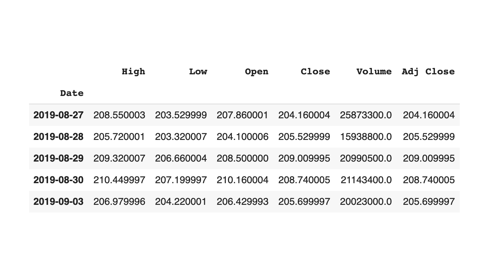
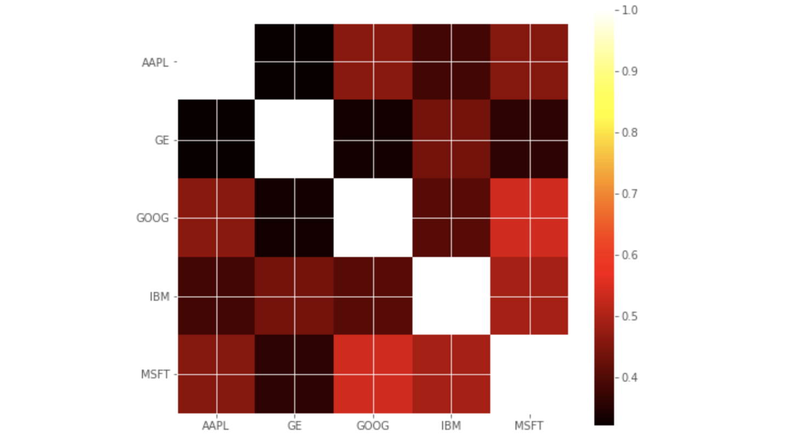

# Apple Stock Prediction
Stock prediction app using scikit learn and pandas

## How it works?
- If you are lazy like me go to this Colab instead of downloading the repository: https://colab.research.google.com/drive/140EGaYlEBK9yGj3_BiGqpAjz8eoc8GEv#scrollTo=-HAsphfeTqtS
- Run all the cells to see the predictions with four different algorithms.
- You can change the value "AAPL" for another stock like "TSLA" to see different results.

## Screenshots

  Apple Stock data fetched from Yahoo finance
  
   
  Apple Stocks Price with The Moving Average (mavg)
  
   
  Heatmap of Correlations among competing stocks
  
   
  Quick Scatter Plot among Stocks Risk and Returns
  
   
  Predictions for the first algorithm Displayed in Plot
  

